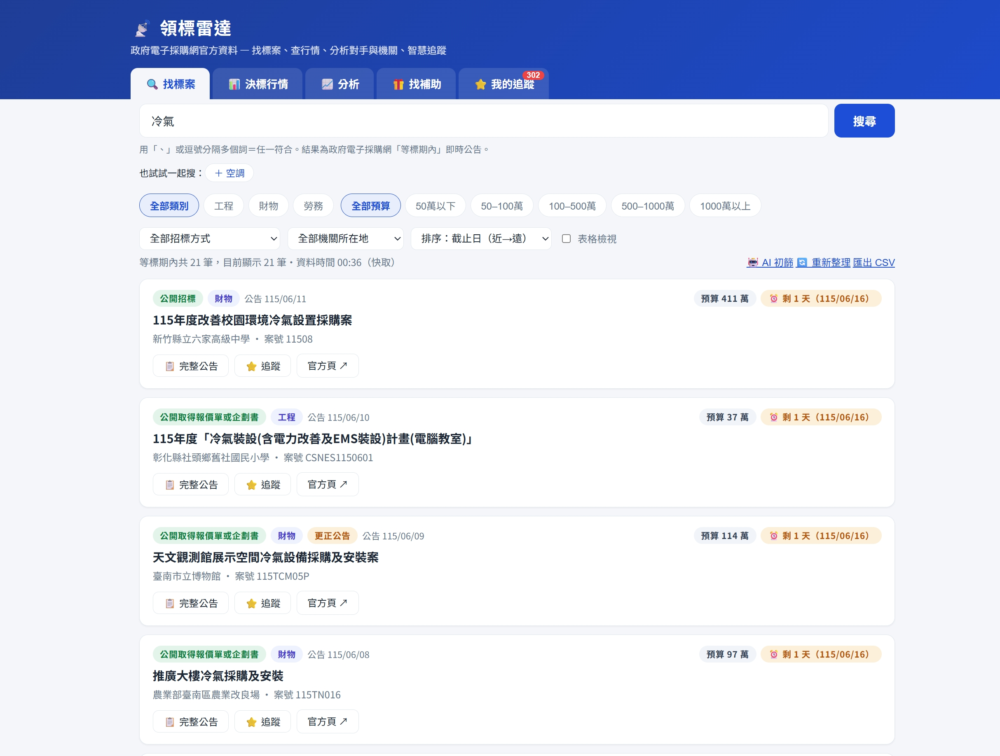
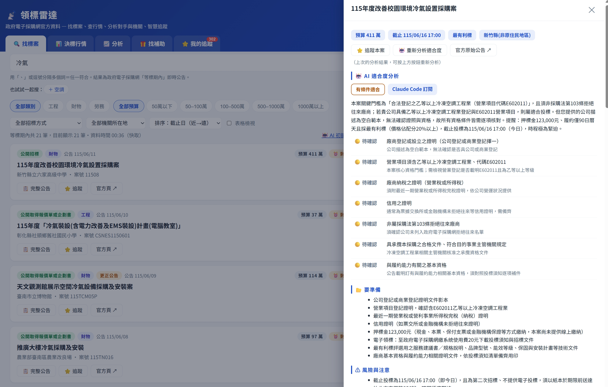
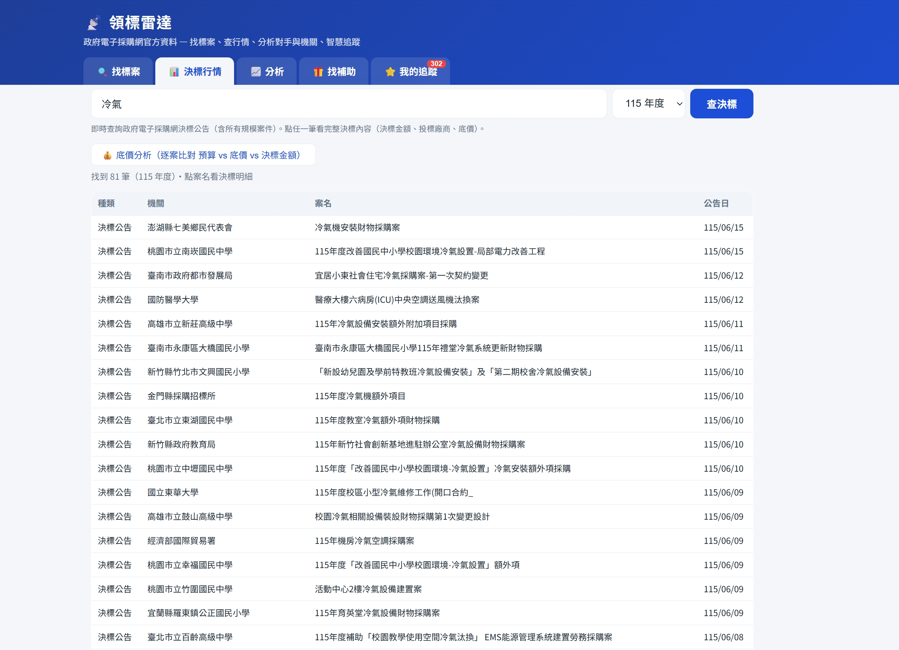
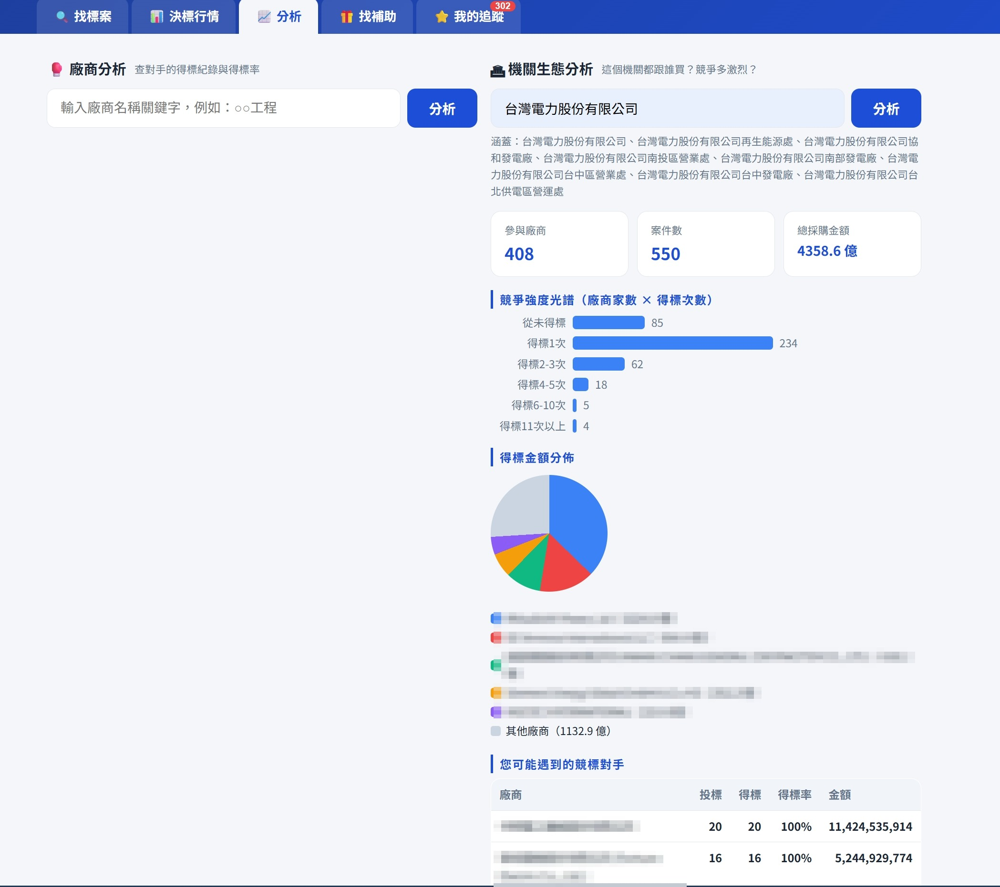
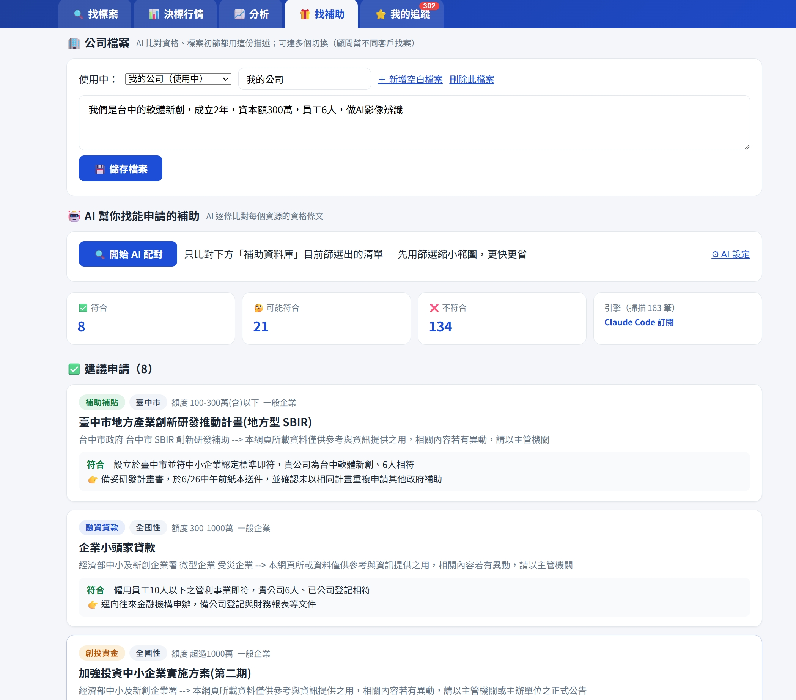

# 領標雷達 · 概念與設計

> 一套用 AI 打造的「政府標案 ＋ 補助」雷達：輸入關鍵字或公司條件，幫你挑出適合的標案與補助。
> 本 repo 分享**概念、設計與資料來源**，方便你用 AI 自己做一套（不含可執行程式碼）。

---

## 這是什麼

台灣的招標／補助資訊散落各部會、格式不一、難讀。領標雷達把這些**政府公開資料**整合進一個介面，再用 AI 幫你做兩件事：判斷「這個標案適不適合我」、比對「我符合哪些補助」。

## 功能規格

### 🔍 找標案
關鍵字搜尋「現在還能投標」的案子，卡片顯示預算／截止／機關，可篩選、排序、匯出 CSV、一鍵追蹤。

*（介面示意）*

### 🤖 AI 適合度分析
丟一個標案給 AI：適不適合、投標門檻、需備文件、潛在風險、決策建議——每個判斷**附原文依據**，避免幻覺。

*（介面示意）*

### 📊 決標行情
查決標金額、底價、決標比、折讓率分佈，掌握市場行情。

*（介面示意）*

### 🏆 找補助（AI 配對）
輸入一段公司描述，AI 逐條比對補助資格，分成 符合／可能符合／不符合，並附理由。

*（介面示意；圖中公司描述為示範用假資料）*

### 📈 分析
- **廠商分析**：對手得標率、往來機關、得標金額
- **機關生態分析**：這個機關都跟誰買、競爭多激烈

*（介面示意；廠商名稱已遮蔽）*

### ⭐ 我的追蹤
watchlist ＋ 截止日提醒。

## 系統架構（概念）

    [ 使用者介面 ]
          |
 [ 後端：彙整 + 查詢 + AI 編排 ]
          |
   +-- [ 可插拔 AI 引擎 ]  雲端 / 本地皆可
   +-- [ 本地資料庫 ]     公開資料本機快取

跑在自己電腦上，資料與運算都在本機。

## AI 設計

- **統一介面**：後端只認一個 AI 介面，業務邏輯不感知背後是哪家模型 → 隨時可換 OpenAI／Gemini／本地模型
- **兩段式補助配對**：1) 規則預篩（0 成本，先刷掉明顯不符）→ 2) AI 批次判讀（比對「資格全文 vs 公司描述」）
- **防幻覺**：每個門檻／風險判斷都必須附「原文依據片段」

## 資料來源

全部取自**政府公開資料**：

| 功能 | 資料來源 |
|---|---|
| 找標案 | g0v 標案 API（[pcc.g0v.ronny.tw](https://pcc.g0v.ronny.tw/)）|
| 決標行情／分析 | 政府電子採購網「決標開放資料」（OpenData）|
| 找補助（清單）| 文化部開放資料（[opendata.culture.tw](https://opendata.culture.tw/frontsite/openData/detail?datasetId=351)）、新創圓夢網（[startup.sme.gov.tw](https://startup.sme.gov.tw/)）|
| 找補助（資格詳情）| **未找到開放資料** → 連結至官方頁，由使用者自行查看 |

> 接公開資料時請禮貌限速、標註來源、本機快取。

## Roadmap（想自己做的建議階段）

| 階段 | 做什麼 |
|---|---|
| **P0** | 地基：介面 ＋ 後端 ＋ 本地 DB |
| **P1** | 找標案（接 g0v API，能搜、能篩）|
| **P2** | 決標行情（OpenData 匯入 ＋ 統計）|
| **P3** | AI 適合度分析（接 AI 引擎 ＋ 防幻覺）|
| **P4** | 找補助（清單 ＋ AI 資格配對）|
| **P5** | 分析、追蹤、本地 LLM 模式 |

## 想自己做？

→ [用 AI 做工具的起手式](AI做工具起手式.md)（痛點講具體 → 先找資料來源 → 能跑的最小版 → 一個個加功能）

## 免責

判定結果**以官方公告為準**；補助／標案資格隨政策變動，請以主管機關最新公告為依據。資格詳情等未開放的部分，請點官方連結查看。

## 交流

想自己做、卡住、或有想法 → 開 issue 或私訊我，互相交流 AI 使用技巧（純交流、不收費）。
